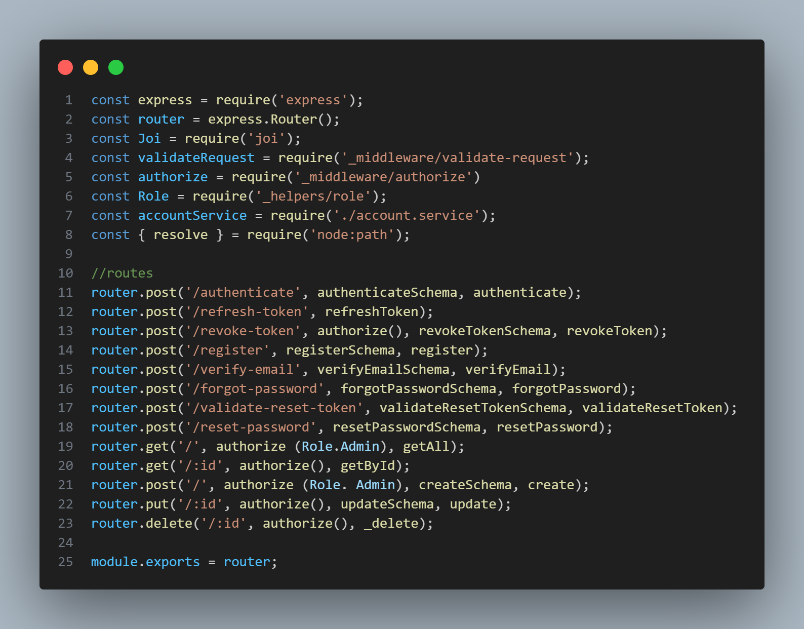
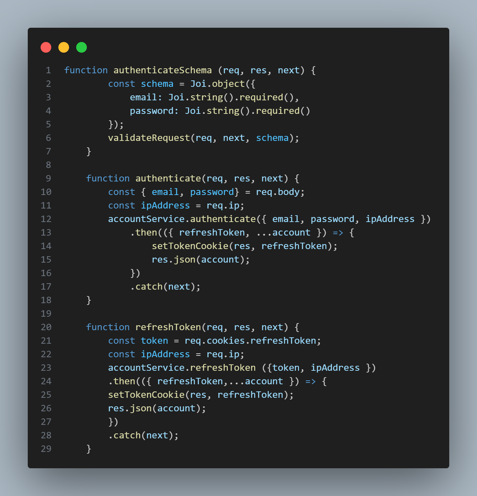
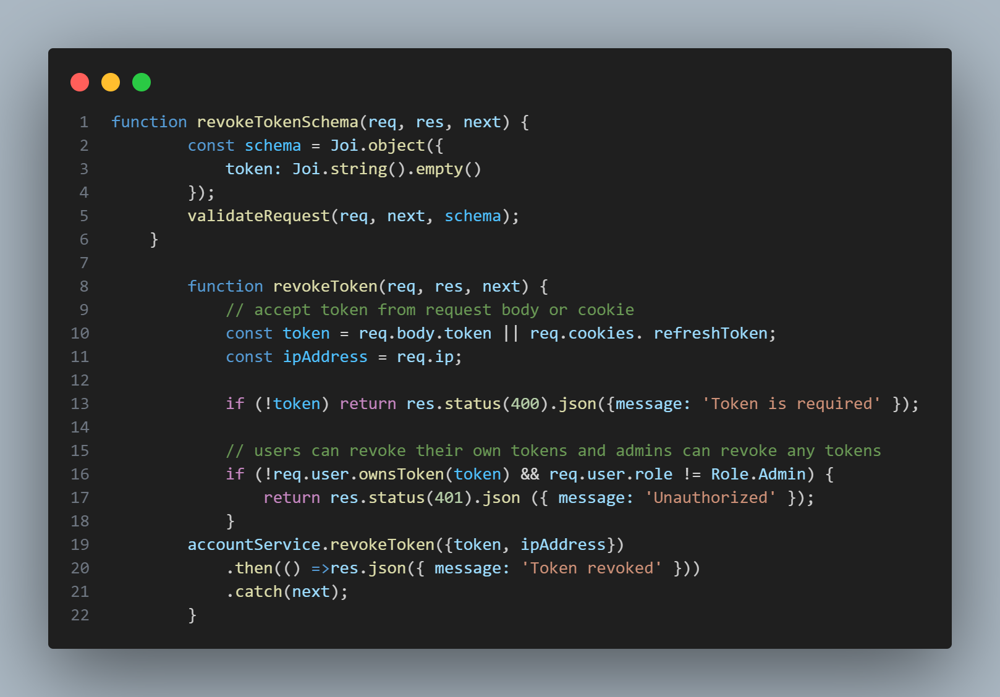
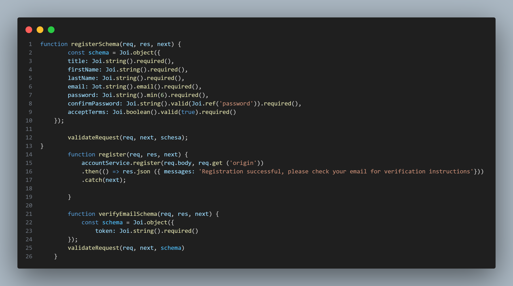
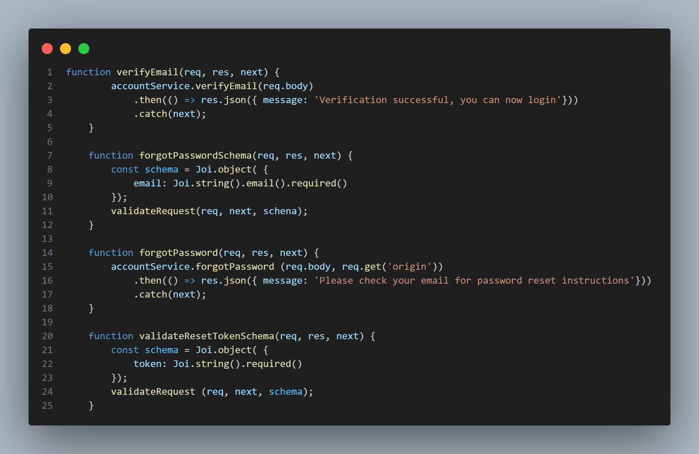
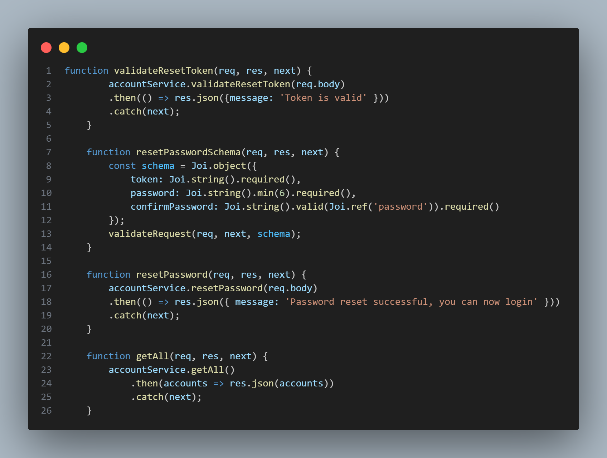
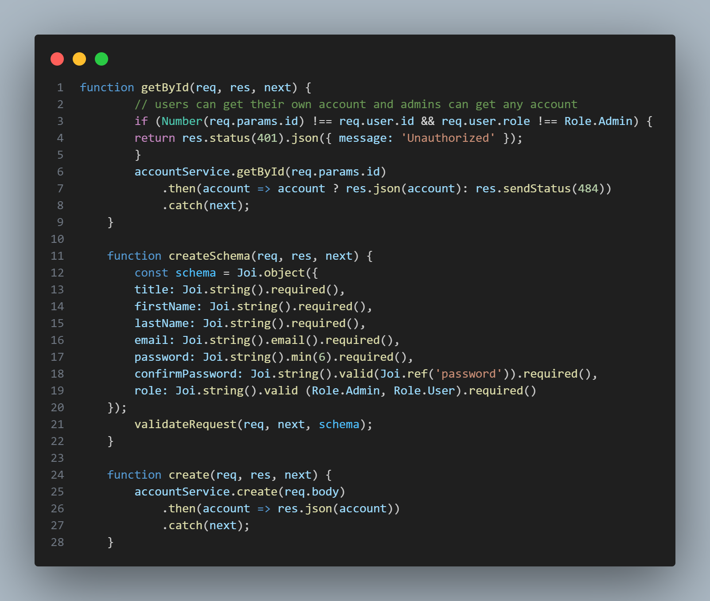
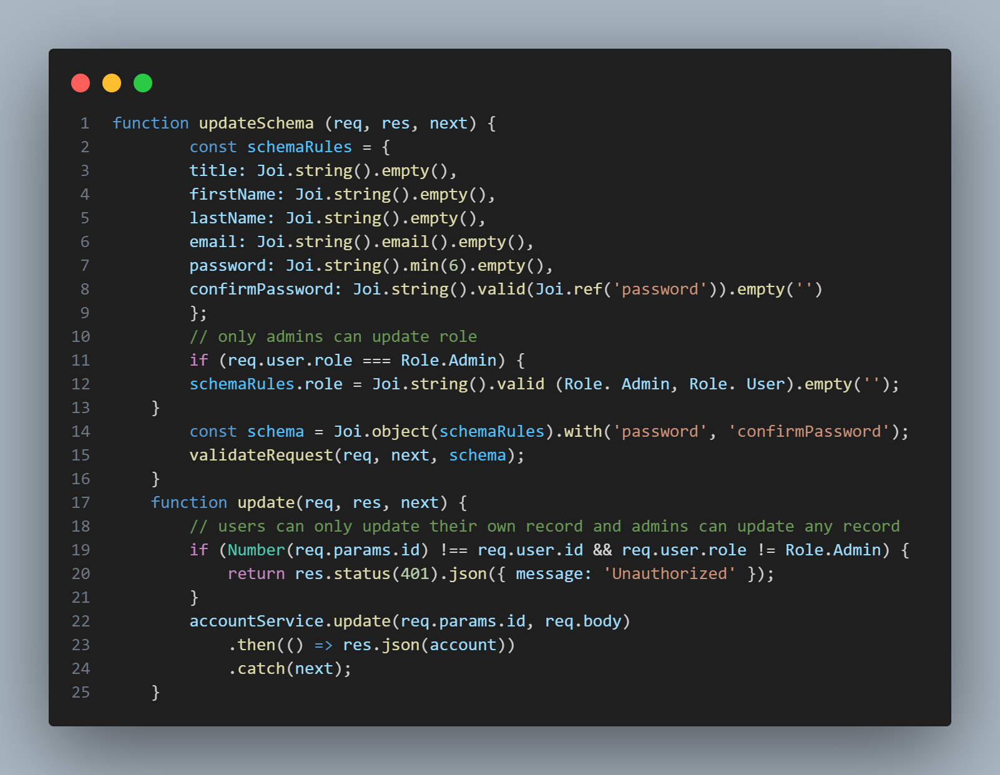
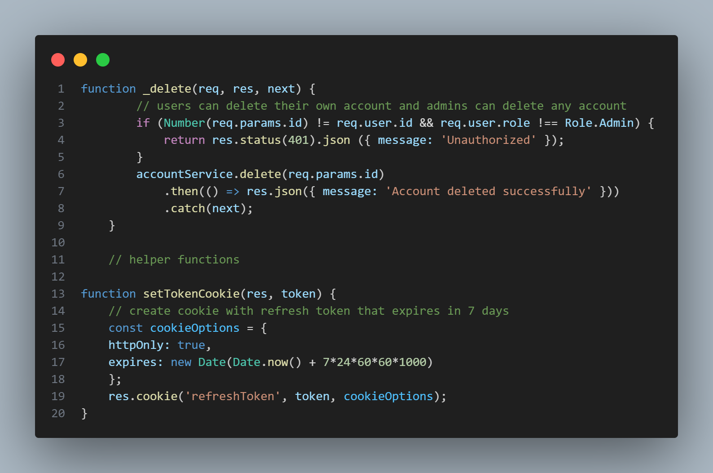

The group will develop a User Management System with the following features:

Backend (Node.js + MySQL):
    Email sign-up and verification.
    JWT authentication with refresh tokens.
    Role-based authorization (Admin and User roles).
    Forgot password and reset password functionality.
    CRUD operations for managing accounts (restricted to Admin users).
Frontend (Angular 10/17):
    Email sign-up and verification.
    JWT authentication with refresh tokens.
    Role-based authorization (Admin and User roles).
    Forgot password and reset password functionality.
    Profile management (view and update profile).
    Admin dashboard for managing all accounts (restricted to Admin role).
    Fake backend implementation for backend-less development and testing.

    Create a New Repository on GitHub:

Go to GitHub and create a new repository named user-management-system.
Initialize it with a README.md file and a .gitignore file for Node.js.
Clone the Repository Locally:

Each team member should clone the repository:
git clone https://github.com/Areoneos/user-management-system to an external site.
Set Up Individual Branches:

Each member creates their own branch:
git checkout -b <your-branch-name>
Example branch names:

backend-signup-auth -                       MOLDEZ
backend-authorization-crud -                LUGAY
frontend-signup-auth -                      CABALLES
frontend-profile-admin-fake-backend -       SARMIENTO
tester-functional-testing -                 to be decided
tester-security-testing -                   to be decided

Use the following command to confirm your active branch:
 git branch

 Express.js Accounts Controller
Path: /accounts/accounts.controller.js

The accounts controller manages all /accounts routes for the Node.js + MySQL boilerplate API. Route definitions are grouped at the top of the file, followed by their corresponding implementation functions and local helper functions. This controller is mounted to the /accounts path in the main server.js file.

Routes that require authorization use the authorize() middleware. Optionally, a role can be specified (e.g., authorize(Role.Admin)). If a role is provided, access is restricted to users with that role; otherwise, the route is accessible to all authenticated users regardless of role. The logic for authorization is handled within the authorize middleware.

Certain route functions—such as revokeToken, getById, update, and _delete—include an additional custom authorization check. This prevents non-admin users from accessing accounts other than their own. Regular users (Role.User) have full CRUD access to their own account, while admin users (Role.Admin) have full CRUD access to all accounts.

Routes that require input validation use middleware functions named with the convention <route>Schema (e.g., authenticateSchema). These functions define validation rules using the Joi library and call validateRequest(req, next, schema) to validate the request body. If validation passes, the request proceeds to the next middleware; otherwise, an error response is returned with details about the validation failure. For more information on Joi, see https://www.npmjs.com/package/joi.

The boilerplate API uses Express, one of the most popular web application frameworks for Node.js. Learn more at https://expressjs.com/.

