The group will develop a User Management System with the following features:

Backend (Node.js + MySQL):
    Email sign-up and verification.
    JWT authentication with refresh tokens.
    Role-based authorization (Admin and User roles).
    Forgot password and reset password functionality.
    CRUD operations for managing accounts (restricted to Admin users).
Frontend (Angular 10/17):
    Email sign-up and verification.
    JWT authentication with refresh tokens.
    Role-based authorization (Admin and User roles).
    Forgot password and reset password functionality.
    Profile management (view and update profile).
    Admin dashboard for managing all accounts (restricted to Admin role).
    Fake backend implementation for backend-less development and testing.

    Create a New Repository on GitHub:

Go to GitHub and create a new repository named user-management-system.
Initialize it with a README.md file and a .gitignore file for Node.js.
Clone the Repository Locally:

Each team member should clone the repository:
git clone https://github.com/Areoneos/user-management-system to an external site.
Set Up Individual Branches:

Each member creates their own branch:
git checkout -b <your-branch-name>
Example branch names:

backend-signup-auth -                       MOLDEZ
backend-authorization-crud -                LUGAY
frontend-signup-auth -                      CABALLES
frontend-profile-admin-fake-backend -       SARMIENTO
tester-functional-testing -                 to be decided
tester-security-testing -                   to be decided

Use the following command to confirm your active branch:
 git branch

 After setting up the project structure.
 We are going to start with the Helpers folder (code snippets that are essential but dont need a folder of their own)

 The db.js works as follows, once the api starts it activates initial code functions like creating a databse if haven't already, connect to database orm, initializes account and tokens, connects to sequelize
 
 

 Next is role.js this serves as a more clean way of setting up the role function with Admin and User

 

 next is the send-email.js
 it is used by account service to send account verifications

 
 
 next is the swagger.js
 it is a route handler and is bound to the /api-docs path in the main server.js file 

 

 Now I'm going to start populating the middleware files
 the middleware folder containt files that can be used by different/features within the Node.js boilerplate api.

 I'll start with the authorize.js

 It manages the the validity of authorization requests of the accounts 

 

 Next is the error handler middleware 
 this is used for errorhandling that can be used through the multiple files and to reduce redundant error handling snippets.

 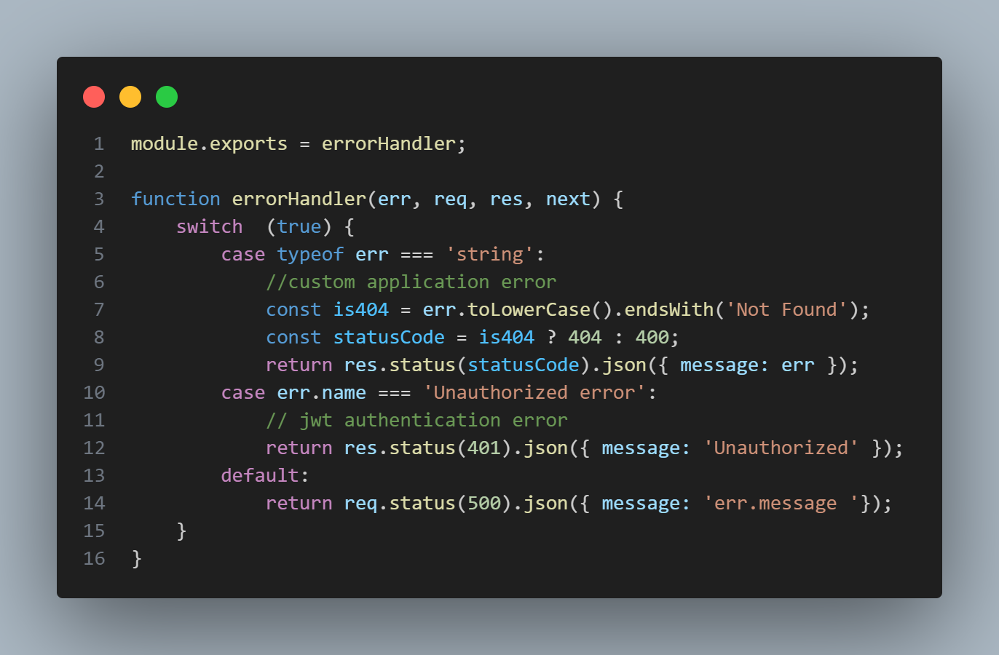

 Next is the Validate Request middleware
 this is used by authentication schema in the accounts controller to validate request against schema for a specific route

 Next is the accounts folder wher the main code starts and handles the many functions of the node.js + mysql boilerplate api.
 Lets start with the sequelize account model

 account model uses sequelize to handle CRUD operations 

 
 
 Refresh-Token to define schema for mysql database

 

 Next is the account service where the business logic and functionality can be found 
 CRUD logic in handling accounts
 

 Express.js Accounts Controller
Path: /accounts/accounts.controller.js

The accounts controller manages all /accounts routes for the Node.js + MySQL boilerplate API. Route definitions are grouped at the top of the file, followed by their corresponding implementation functions and local helper functions. This controller is mounted to the /accounts path in the main server.js file.

Routes that require authorization use the authorize() middleware. Optionally, a role can be specified (e.g., authorize(Role.Admin)). If a role is provided, access is restricted to users with that role; otherwise, the route is accessible to all authenticated users regardless of role. The logic for authorization is handled within the authorize middleware.

Certain route functions—such as revokeToken, getById, update, and _delete—include an additional custom authorization check. This prevents non-admin users from accessing accounts other than their own. Regular users (Role.User) have full CRUD access to their own account, while admin users (Role.Admin) have full CRUD access to all accounts.

Routes that require input validation use middleware functions named with the convention <route>Schema (e.g., authenticateSchema). These functions define validation rules using the Joi library and call validateRequest(req, next, schema) to validate the request body. If validation passes, the request proceeds to the next middleware; otherwise, an error response is returned with details about the validation failure. For more information on Joi, see https://www.npmjs.com/package/joi.

The boilerplate API uses Express, one of the most popular web application frameworks for Node.js. Learn more at https://expressjs.com/.

Alert Component Template
Path: /src/app/_components/alert.component.html
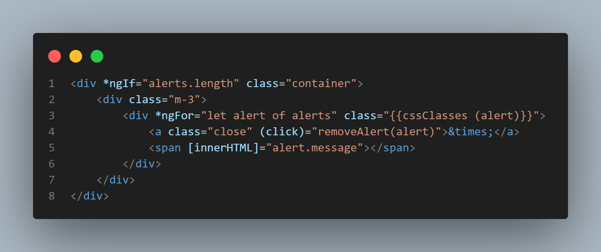
This component shows a list of alert messages.
It only renders when alerts is not empty.
Each alert has a dynamic style (like success or error).
Alerts are dismissible with a close button.
Messages can contain HTML content.

Alert Component
Path: /src/app/_components/alert.component.ts
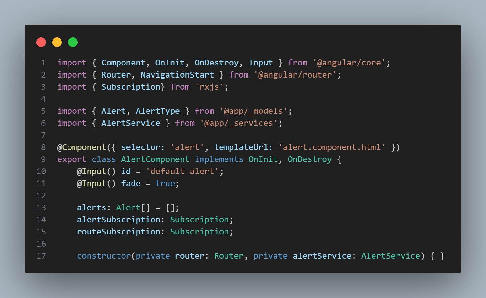
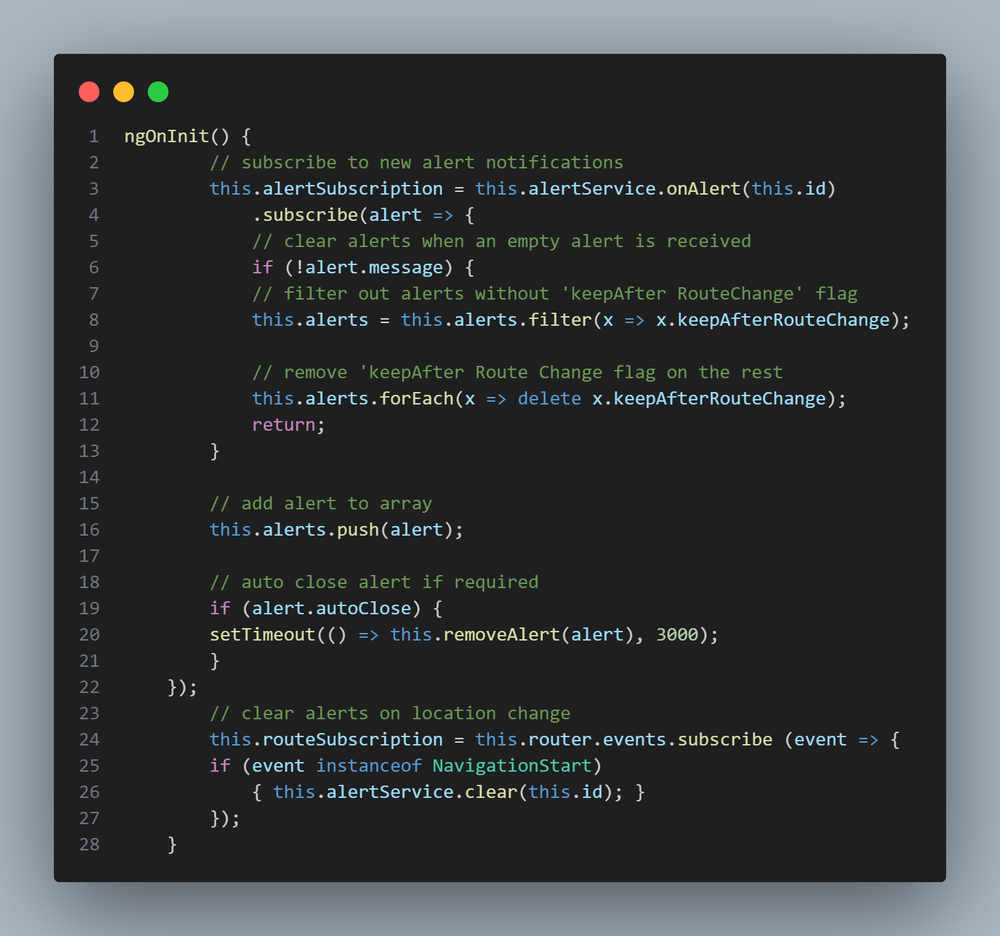
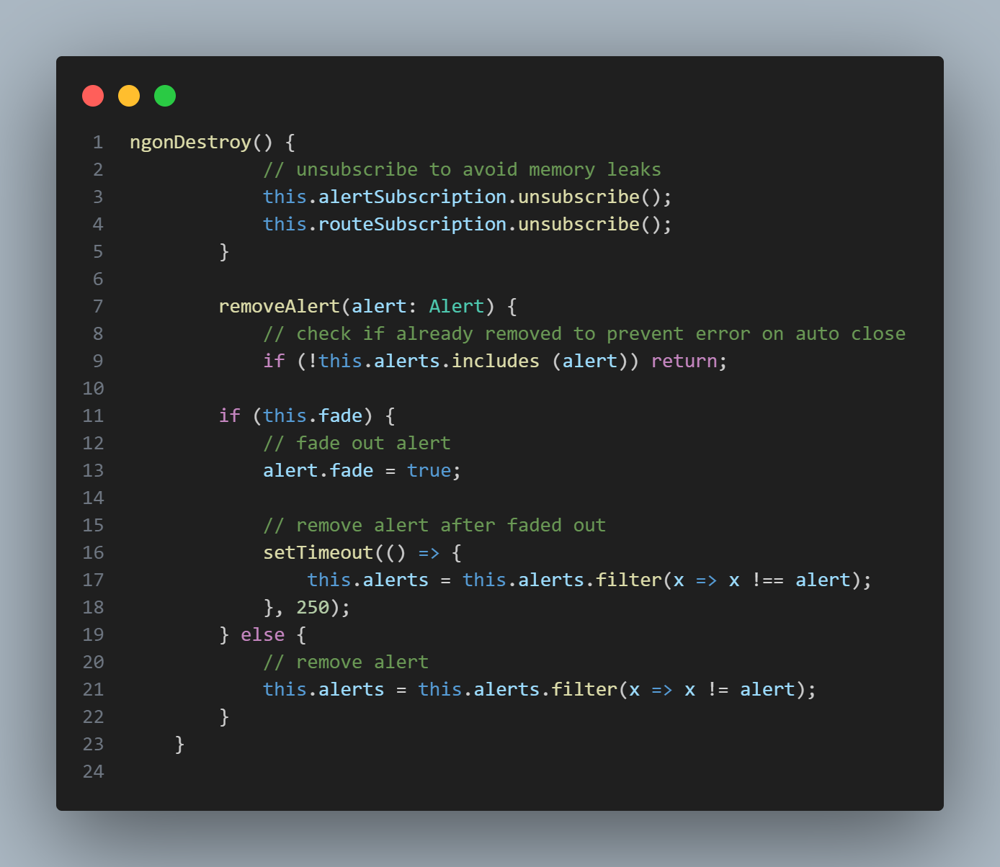
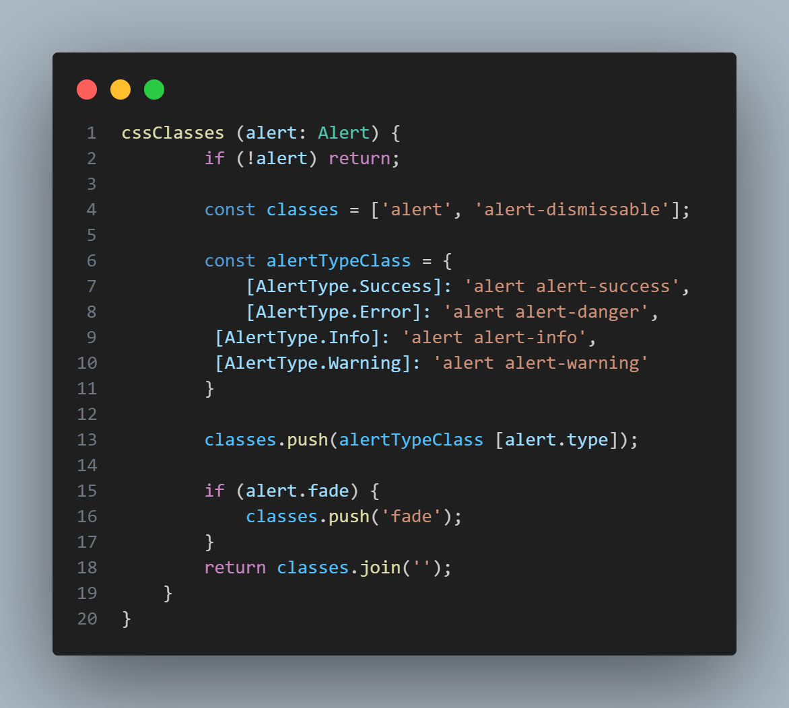
This component displays a list of alerts.
You can customize each alert’s appearance and behavior (like fading or auto-close).
Alerts can be removed manually or automatically.
Alerts are cleared on navigation unless flagged to persist.
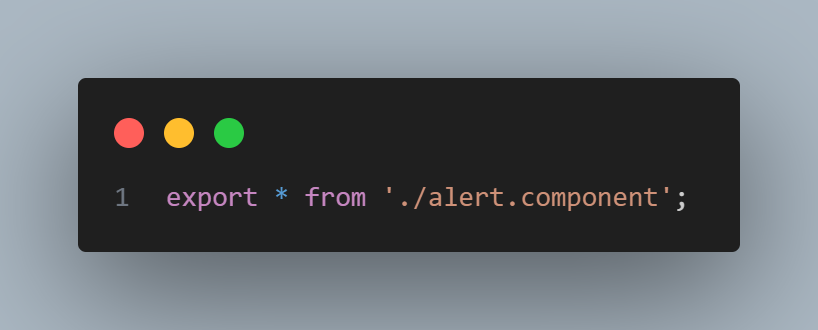
It exports everything (all exported members) from the alert.component.ts file.

App Initializer
Path: /src/app/_helpers/app.initializer.ts
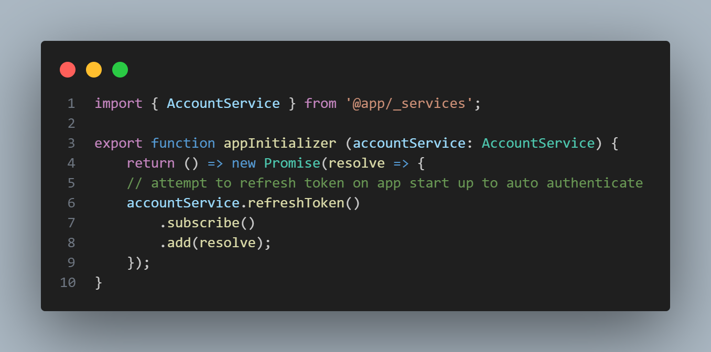
Refreshing auth tokens before the app starts
Loading user settings
Fetching essential config from a server (like environment settings)

Auth Guard
Path: /src/app/_helpers/auth.guard.ts
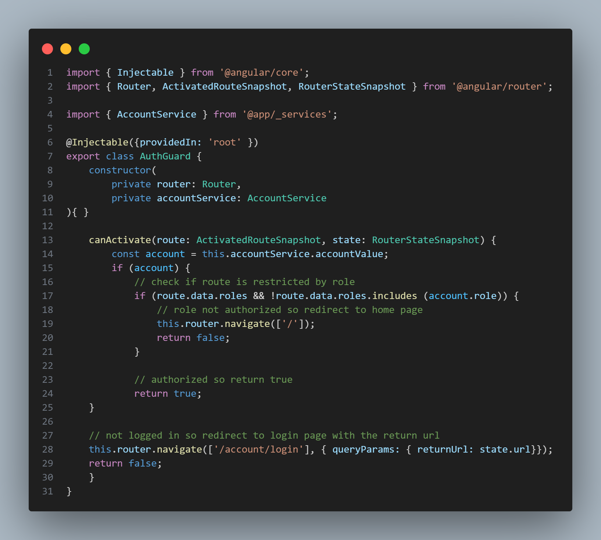
Allow navigation
Redirect to login
Block access based on user roles

Error Interceptor
Path: /src/app/_helpers/error.interceptor.ts
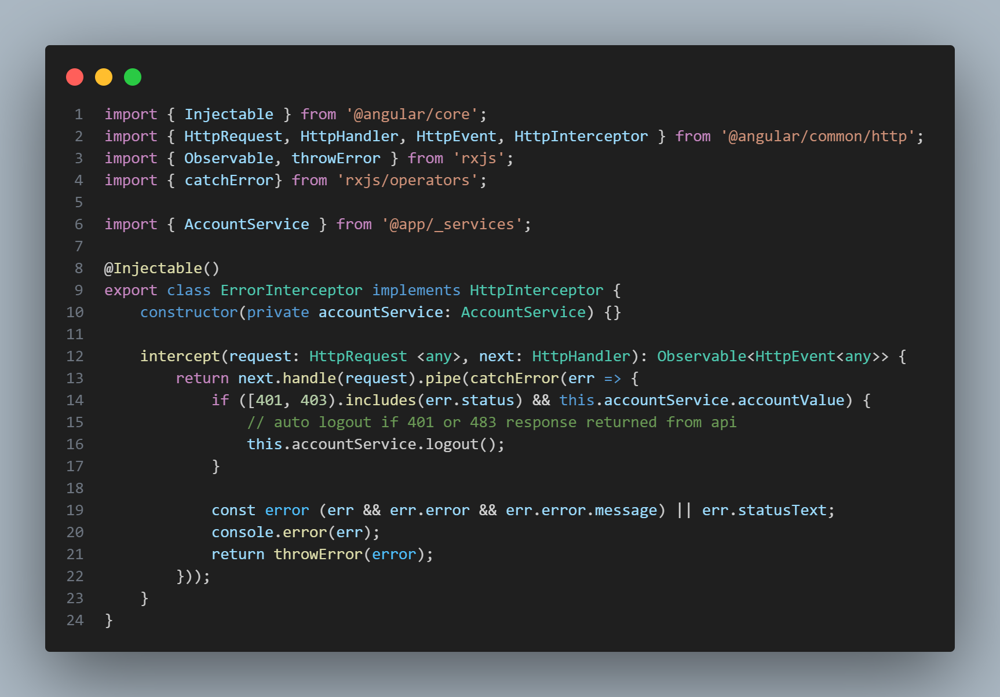
Intercepts all HTTP requests/responses.
Catches errors and allows you to:
Log out users on specific status codes.
Show user-friendly error messages.
Log or track backend issues.

JWT Interceptor
Path: /src/app/_helpers/jwt.interceptor.ts
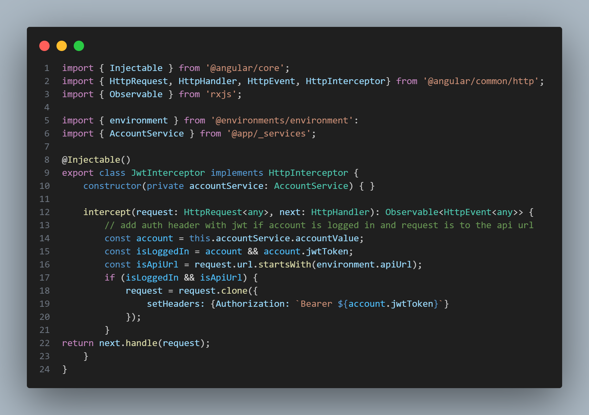
Intercepts all HTTP requests.
Checks if the user is logged in and if the request is going to your API.
If both conditions are true, it adds the Authorization header with the JWT.

Must Match Validator
Path: /src/app/_helpers/must-match.validator.ts

This validator makes sure that two fields match (like "Password" and "Confirm Password").

Next I am goin to start with the config.json
